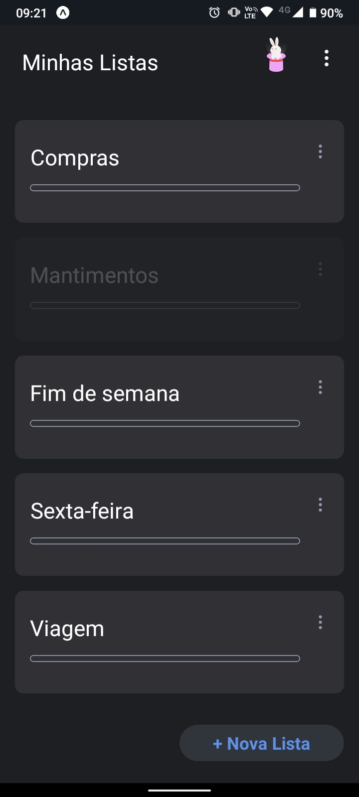
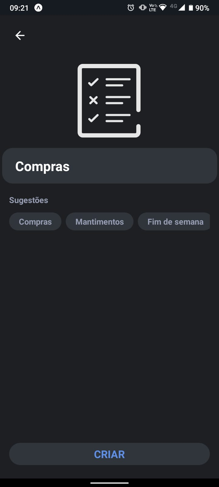

# Aplicativo para lista de compras
Aplicativo para criação e gestão de lista de compras feito com Expo, React-Native, Typescript e styled-components.

<h1 align="center">
    
    
</h1>

## 🚀 Motivaçao / objetivo

A motivação foi através de um amigo que surgiu com a idéia e apresentou um aplicativo já existente. O objetivo era conseguir fazer um aplicativo que fosse semelhante ao existente.

## 💻 Requisitos

Antes de iniciar, você deve ter o Node.js e o NPM instalados em sua máquina.

## 🚀 Instalando

Primeiro, você deve clonar o projeto na sua máquina, para isso você
pode colar o seguinte comando em seu terminal

```bash
git clone https://github.com/Tiago-Silva/ShoppingList.git
```
Para instalar as dependências, execute o seguinte comando:

```bash
npm install
```
ou

```bash
yarn install
```

Por fim, para executar o projeto basta rodar o seguinte:

```bash
yarn expo start
```

### Features

Tecnologias usadas nesse projeto:

<!-- Ícones de tecnologias. Você pode encontrar esses ícones em sites como https://simpleicons.org/ -->
<p align="center">
  <a href="https://skillicons.dev">
    
  </a>
</p>


## 📝 Licença

Este projeto está licenciado sob a licença MIT. Consulte o arquivo `LICENSE` para obter mais informações.
